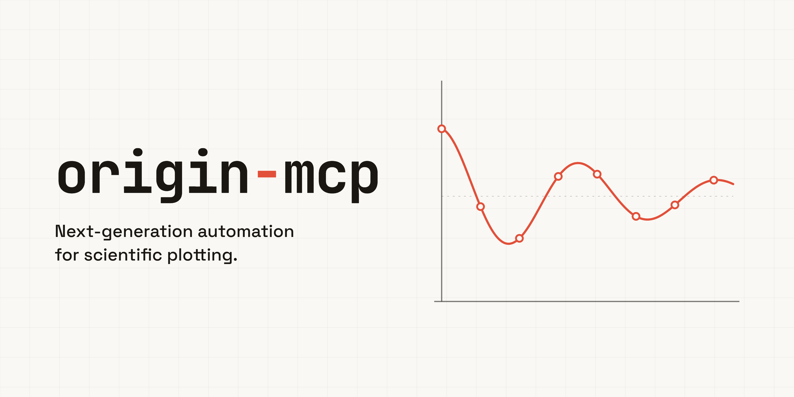

# origin-mcp



[](https://pypi.org/project/origin-mcp/)
[](https://pepy.tech/projects/origin-mcp)
[](https://pypi.org/project/origin-mcp/)
[](https://glama.ai/mcp/servers/Ge-Shun/origin-mcp)
[](LICENSE)

[简体中文](README.zh.md)

`origin-mcp` is a local Model Context Protocol (MCP) server that lets AI
assistants control Origin/OriginPro on Windows. An authenticated local bridge
runs inside Origin so automation stays on its UI thread. The project is still
in testing; real-workflow feedback and contributions are welcome.

## Highlights

- Import, edit, transform, and export worksheet, matrix, image, and connector data.
- Create and refine 2D, 3D, contour, statistical, and specialized plots.
- Run fitting, signal processing, statistics, Peak Analyzer, and batch workflows.
- Manage projects, folders, Notes, templates, analysis operations, and graph layouts.
- Build publication figures with reusable templates, palettes, and an optional
  [Nature-style preset](docs/tools.md#palette-catalog).

## Quick Start

You need Windows, a licensed Origin/OriginPro installation, and Python 3.10+
for the MCP server. Origin 2026/2026b is the current target family; the bridge
uses the Python bundled with Origin.

1. Install the MCP server:

```bash
pip install origin-mcp
```

2. Add the MCP server to your client (use the absolute `python.exe` path if
   `python` points to another environment):

```json
{
  "mcpServers": {
    "origin": {
      "command": "python",
      "args": ["-m", "origin_mcp"]
    }
  }
}
```

3. Install the Origin Start/Stop Apps, follow the short
   [registration guide](docs/origin-ui-buttons.md), then click
   **Origin MCP Bridge Start** once per Origin session:

```powershell
origin-mcp install-origin-app --force
```

4. Verify the bridge and live Origin connection:

```powershell
origin-mcp status
origin-mcp doctor --ping-origin
```

Both diagnostic commands support `--json`. For manual bridge startup or
troubleshooting, see the [bridge guide](docs/origin-bridge.md).

To let an AI agent install and configure origin-mcp, send it this instruction:
`Fetch and follow https://raw.githubusercontent.com/Ge-Shun/origin-mcp/main/docs/agentic/origin-mcp-bootstrap.md end to end.`

## Documentation

- [MCP client configuration](docs/mcp-config.md)
- [Origin Start/Stop Apps](docs/origin-ui-buttons.md)
- [Bridge setup and troubleshooting](docs/origin-bridge.md)
- [Tools, profiles, styling, and error recovery](docs/tools.md)
- [Agentic bootstrap guide](docs/agentic/origin-mcp-bootstrap.md)

## Development

From a checkout, install with `pip install -e .` and run the full local gate:

```bash
python scripts/dev_check.py --tests
```

## Security

The bridge listens only on `127.0.0.1` and authenticates local requests by
default with a per-session token. Treat the token as a credential, keep its
handshake file in a user-private directory, and avoid
`ORIGIN_MCP_BRIDGE_NO_AUTH` unless every local process is trusted. Set
`ORIGIN_MCP_ALLOWED_ROOTS` to restrict which files tools may access.

## License

MIT. See [LICENSE](LICENSE).
